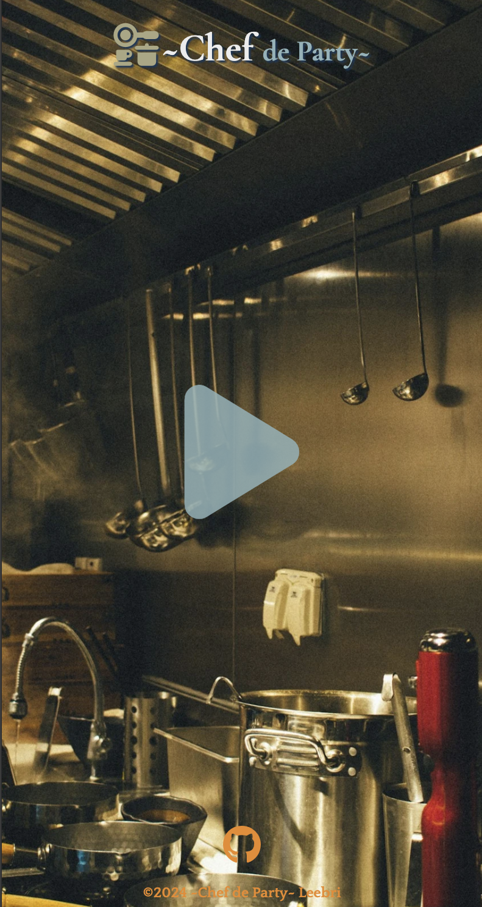
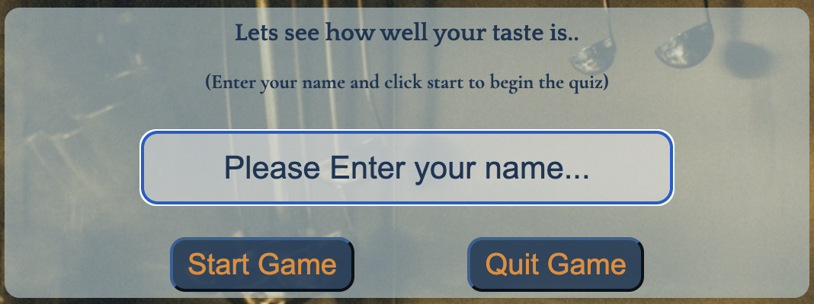

# **Chef de Party**
## **Site Preview**
<!-->
### Live link
(https://leebri101.github.io/Chef-de-Party/)
## Contents-Page:
1. [**Project-Planning**](#project-planning)
    * [**Target Audiences**](#target-audiences)
    * [**User Stories**](#user-stories)
    * [**Site Objectives**](#site-objectives)
    * [**Wire-Frames**](#wire-frames)
    * [**Reused Code**](#reused-code)
1. [**Current Features on all pages**](#current-features-on-all-pages)
    * [**Home-Page:**](#home-page)
        * [*Title*](#title)
        * [*Call To Action Button*](#call-to-action-button)
        * [*Start-Game-Section*](#start-game-section)
    * [**Quiz-section:**](#quiz-section)
        *
        *
        *
    * [*Skills-Page:*](#skills-page)
        * [*Core-Languages*](#core-languages)
        * [*Advanced Front-End*](#advanced-front-end)
        * [*Back-End*](#back-end)
        * [*Miscellaneous*](#miscellaneous)
    * [*Projects-Page:*](#projects-page)
        * [*Mobile-Version*](#mobile-version)
    * [*Contact-Page*](#contact-page)
    * [**Footer**](#footer)
    * [**Typesetting**](#typesetting)
1. [**Potential-Features**](#future-enhancements)
1. [**Deployment**](#deployment)
1. [**Credits**](#credits)
    * [**Honorable mentions**](#honorable-mentions)
    * [**General reference:**](#general-reference)
    * [**Content**](#content)
    * [**Media**](#media)

## **Project Planning**
### **Target Audiences:**
* For users who want to be able to enjoy a short quiz.
* For users who enjoy a short interactive game.

### **Site Objectives:**
* Allowing users to easily interact with the page without any technical or difficult complications. 
* To create a simple, effective and user-friendly quiz page which anyone can use or take inspiration from.

### **User Stories:**
* As a user I want to be able to navigate the site with ease.
* As a user I want to enjoy being able to do a short quiz that doesn't make it long or boring.
* As the owner I want to be able to see a simple but smooth transition in animations used in the quiz. 
* As the owner I want to be able to allow users to feel comfortable with interacting with the simple commands. 

### **Wire-Frames:**
* To prevent any digressions towards the project aims & objectives I have made a basic wire-frame via [Figma](https://www.figma.com/board/XEvFJX797o9pZ8cLhqcUOX/Chef-de-Partie?node-id=0-1&t=ahsLbSTdHofYGlSp-0) to refer back to in case of any major changes to the project. 

[Wireframes](doc/wireframes/) were all designed in Figma for a more simple but effective design. 
* [Landing-Page](doc/wireframes/landing-page.png)
* [Placeholder-name](doc/wireframes/placeholder-name.png)
* [Q&A Section](doc/wireframes/q-and-a.png)
* [Results-section](doc/wireframes/feedback.png)

There have been some considerable cosmetic changes to the static site to improve the UX, however most of design was kept to original plan on the wire-frames. Some of these changes may include:-
* An interactive CTA(Call-To-Action) button for the user to use.
* A placeholder which prompts users to enter their name to start the quiz.
* A mixture 10 of cooking/food related questions which are randomized, with 4 options at which the user is prompted to answer the question.
* A Results/Feedback pop-up which displays the users score and a funny custom message (dependant on the range of the score) to the user as well as a animated image or GIF. 

### **Reused Code:**
* Some of the code that has been used in this project have been re-used from the previous projects due to the simple and effective structure it has on the layout of the final design.
    * All links have the same hover-over effect at which it changes color and size upon hovering.
    * Once clicked it will change color. 
        * Miscellaneous reused content:
        * General reused code from previous project.
        
        * Reused root structure code for simplicity of selecting the same colors.
        

## **Current Features**
###  **Home-Page:**
* The home-page will have multiple unique features which the user can do upon navigating which will contain these most notable features:

### *Title:*
* The Title will include some unique features:-
    * The main title of the page includes a two tone text to keep within theme of a restaurant.
    * Upon loading a animation with the title will appear and shifts the letters of the title.
    * And small cookware icon within the title.

### *Call To Action Button:*
* A hover-over design to be able at which users can interact with , which instantly grabs the users attention.
 
    * A simple but clean hover over effect where it transitions into a dark navy blue to match the theme of the page.
    * An active page navigation where it allows the user to hover over the different page links and show which page they are currently on.  
    * Direct web-links where it take the user to my GitHub so that they can manually view each of my projects. 
    
    
* Mobile version of home page with title, icon, buttons and web-links.

### **Start-Game-section:**
* Upon clicking into into the CTA button it will enter into teh start-game section with a autofocus placeholder text box which prompts users to enter a name, allowing for more accessibility to users, which is useful on mobile devices, as a text cursor is already highlighted within the text box which saves time for users to manually navigate.  

    * An error handler will display as a red border within the text box if the user has not provided a name or text. 

* It also has two interactive buttons for input, one which is to Start Game which users must enter a name, manually click on the button to start the game/quiz, and teh quit button which it will take the user back onto the main screen where it will display the CTA button.
    * An event listener is in place where the user has the option to press ENTER which wil have the same response as clicking the Start-Game button.

### **Quiz-Section:**
Within the quiz section i will highlight/summarize each of the most notable features of the quiz section. 
#### *Quiz-Tracker:*
Features used:
* An indicator is displayed on the top of the question which tracks the current question the user is on.
* A timer is also in place with an animation which shakes each time a second is lost within the alloted time length of 30 seconds.
* A time bar is also there to track the alloted time left on the quiz, however each time a second is lost the bar is reduced in size which will go from green, to yellow and red and will restart.

* The user can manually navigate with ease to have a look at my current skill levels all contained in a simple but effect carousel. Each end will have two chevrons at which have a hover effect and turn a sandy gold upon moving the mouse (as seen above in the Miscellaneous image) 

### **Projects-Page:**
* The original design of the page was supposed to be within a boxed container within a pyramid scheme of each of the projects at which the user can navigate to which directly sends them to a new tab of each of the projects listed in its respectable links with the inclusion of 2 unique GIFs to display to the user.(I have also placed a disclaimer note on project 3 as the live link is broken and will be amended at a later date).

### *Mobile-Version:*
* Mobile version of the projects-page with an inter-changeable design of a horizontal view of the projects to a vertical view (Fully view on live link).

### **Contact-Page:**
* The contact page will have a none-working function at which the user can input all their details with the functionality of a contact form but it users will not be able to submit anything (due to the lack of knowledge of PHP).

### *Mobile-Version*
* The Mobile version will have a shrunken down version of the contact form with the animation of one of imagery in the background of the contact which is viewable on mobile devices.

### **Footer:**
The footer page has a wave animation at which it is only used for display purposes which blends in very well with the background. 
* These are the features that have been used in the footer:
    * All the icons that were used in the project have been sourced by through Font Awesome. 
    * A personal copyright has been added in-case of plagiarism.
    * A personal link to my GitHub page which users can track my coding journey.

    

## **Typesetting**
 Throughout the Project Portfolio only two fonts was used throughout for consistency:
  * Quattrocento:- For the classic french bistro typography look. 

  * Cormorant Garamond:- Similar to Quattrocento but more of a softer look for the text. 

* Please note that all fonts that have used in the project have been sourced from Google Fonts (quoted in the credits).

## **Potential-Features**
*  Through some experimentation and testing throughout the quiz I have wanted to make a quiz that is more simple, effective and interactive as possible previous from the first quiz I made from my previous project with future things to add:
    * Having an interchangeable leader-board which allows other users/players to see their rankings at the end of the results page. Which will change frequently

This personal project portfolio page with be an ongoing improvement as I study more advanced coding to change and improve the appearance of the page and functionalities:

## **Deployment**
The project has been deployed with the following steps:-

1. Within the project's [repository](https://github.com/leebri101/Tech-Savvy), you select the **Settings** tab.
2. Then select the **Pages** menu tab on the left side.
3. Under **Source** then, select the **Main** branch from the drop-down menu and click **Save**.
4. A message will then pop up that the project has been successfully deployed with a live link.

You can visit the live link via this URL or on the top the README file- [Chef-De-Party](https://leebri101.github.io/Chef-de-Party/)

## **Credits**
### **Honorable mentions**
It was a nice refresher for me to comeback and re-learn JavaScript and to see how much I can make the quiz a lot better compared to the first one that I have created from the previous course that I attended, but however it was refreshing to see how much I can improve and learn, thinking beyond from last year from learning it from scratch to continuously think. "How can I make this better? What can I do to make it standout more? Or I think this would look better". From this I can see from myself that i have more qualities of being a good Web Developer, but i must credit the following people:
 * John Lamontagne my coding mentor who is amazing at giving me advice, tips & tricks for always improving my projects, not only on a curricular base level, but in a real life perspective too, and to always make me think on the perspective of both teh user/owner,  always giving a thorough analysis to ensure that I always achieve my highest potential as an upcoming developer 

* My older brother for always being available for being a personal guinea pig for my projects (and as a non-coding person) and (with many more to come) and giving me constant constructive critical feedback all the time.

### **General reference:**
* The project theme was based around a similar concept of the previous project i have made in the past, but of a different theme I made but with more changes to make it more effective, functional and clean with little to no bugs as possible to ensure a higher accuracy of clean code as good practice for entering into the industry, but to also make a fun short quiz for users to play. 

* I have used W3Schools for a basic understanding and learning process for knowing some basic functionality as a way of reminding some stuff, and for general basic coding references and as general encyclopedia for any code related issues or ideas, some of the designs for the main parts of the page are taken from inspiration from CodePen (but were not used they may have been used a visual reference).

### **Content:**
* All icons that were used throughout the project are sourced from [Font-Awesome](https://fontawesome.com/)
* All fonts used have been imported from - [Google-Fonts](https://fonts.google.com/)

### **Media:**
* Color picker site [Image Color Picker](https://imagecolorpicker.com/)
* Image compressions: [TinyPNG](https://tinypng.com/) 
* For the basic and simple wire-frame design as a professional and practical project planning platform [Figma](https://www.figma.com/?fuid=).
* Alternative image converter [FreeConvert](https://www.freeconvert.com/).
* Image compress/converter [Convertio](https://convertio.co/). 
* Google fonts for restaurants [Medium](https://medium.com/bentobox-design/font-pairings-our-favorite-google-fonts-for-restaurants-d157e4c5e5fd).
* First color palette [Color Hex](https://www.color-hex.com/color-palette/10105)
* Second color palette [Color Hex](https://www.color-hex.com/color-palette/67983)
* Background 
Image [Unsplash](https://unsplash.com/photos/stainless-steel-cooking-pots-on-stove-0EkWTSFXwCc)
* https://giphy.com/
