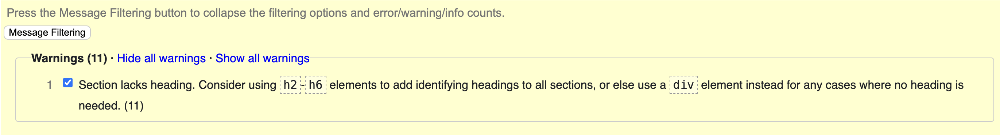
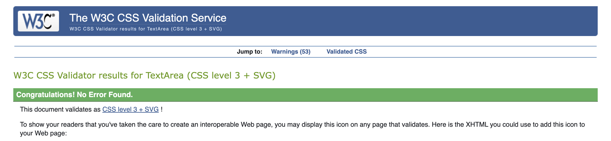
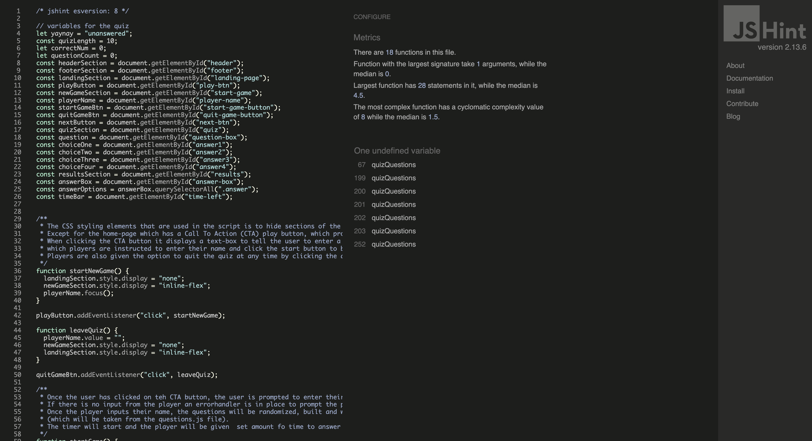
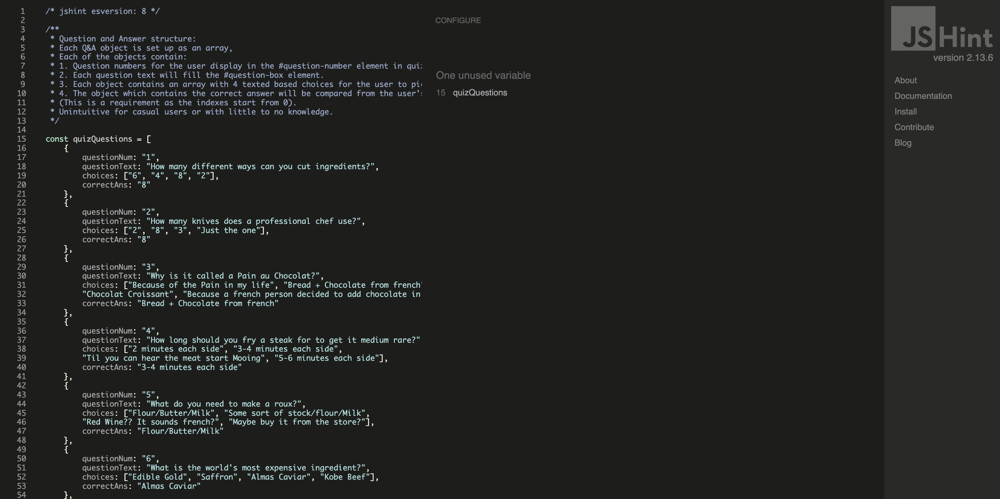

# Testing Page of Contents
* [**Development Testing Phase**](#development-testing-phase)
    * [**Manual Testing Phase**](#manual-testing-phase)
    * [**Known Issues and Solutions and Bugs**](#known-issues-and-solutions-and-bugs)
* [**Post Development Testing-Phase**](#post-development-testing-phase)
  * [**Validator Testing**](#validator-testing)
    * [**HTML**](#html---httpsvalidatorw3orgnu)
    * [**CSS**](#css---httpsjigsaww3orgcss-validator)
    * [***JavaScript**](#javascript---httpsjshintcom)
  * [**Lighthouse Scoring**](#lighthouse-scoring)

## **Development Testing Phase**
During development phase of the quiz, I have been manually testing the site in two ways:-
    
1. Firstly by publishing the page via GitHub and sharing it with friends and family to test different outcomes and functions within a set controlled environment, and receive feedback on major and small changes that needed to be rectified.

1. Secondly, self testing the site to ensure that "I" as the creator know what to expect of the site.

### **Manual Testing Phase**
* During the testing phase, I used three different browsers to ensure consistency & cross-platform connectivity. The browsers used in the tests are:

  1. Chrome
  2. Opera GX
  3. Edge
  
* 

* Google Chrome: 

* Opera GX:

* Microsoft Edge:

### **Known Issues and Solutions and Bugs**
* There is only a tiny amount of cosmetic issues which dpo not hinder the main functionality of the quiz but these will bve noted down in their respected numbers for easier understanding. 

* Known Issues:
  1. Issue 1:
  Styling issue with spacing of timer function and text. 

  * 
    

* Solutions: 
  1. Solution 1: To possibly change some of the styling to ensure that there is more visibility to the user.

   

* Bugs: 
  * 
     
    
## **Post Development Testing Phase**
### **Validator Testing**

#### **HTML** - https://validator.w3.org/nu/

* 0 major errors, 11 warnings have been found mostly due to the lack of headings for the HTML file.

#### **CSS** - https://jigsaw.w3.org/css-validator/

* CSS page has been tested, no issues found via URL or file upload.

#### **JavaScript** - https://jshint.com/
  
Script JavaScript JSHINT: 

Quiz Questions JSHINT:

Both have no errors only minor issue with quizQuestions on main script as it is just from the quizQuestions script which is linked onto the HTML file. 
### **Lighthouse Scoring**

### **Testing Conditions:**
* 
* 

#### **Desktop Version:**
* 

**Maintaining the score:**

#### **Mobile Version:**
* 
* 
* 
* 

[Go back to README.md](README.md)
